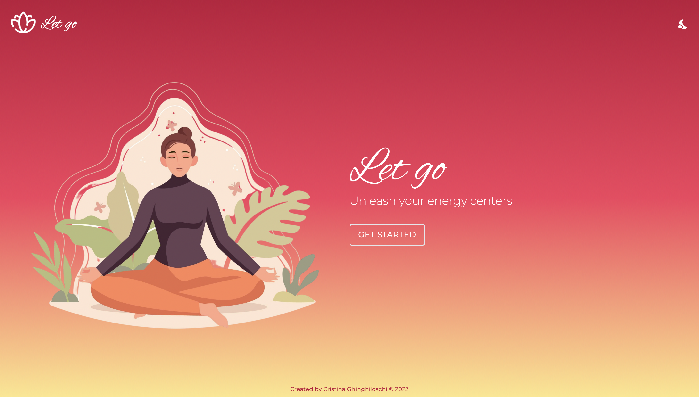

<h1 align="center">🚀 S2I • React Project</h1>
<h3 align="left">Hello 👋, I'm Cris! 
I'm a student at Start2Impact University and this is my practical project for the React framework course.</h3>

For this project, I've created a website that facilitates meditation. The essential feature is a timer that users can set to determine the duration of the activity.</h3>
<h3 align="center">https://letgomeditation.netlify.app</h3>

# Home
The application consists of a simple homepage that invites the user to start with meditation. 
When the user clicks on the '<strong>GET STARTED</strong>' button, they access the second page of the application where they find the timer. 

  

### Languages
• HTML 
• CSS 
• [tailwindcss](https://tailwindcss.com) 
• [React](https://react.dev) 

### Bundler 
[Vite](https://vitejs.dev)

### Webhost
[Netlify](https://www.netlify.com)
